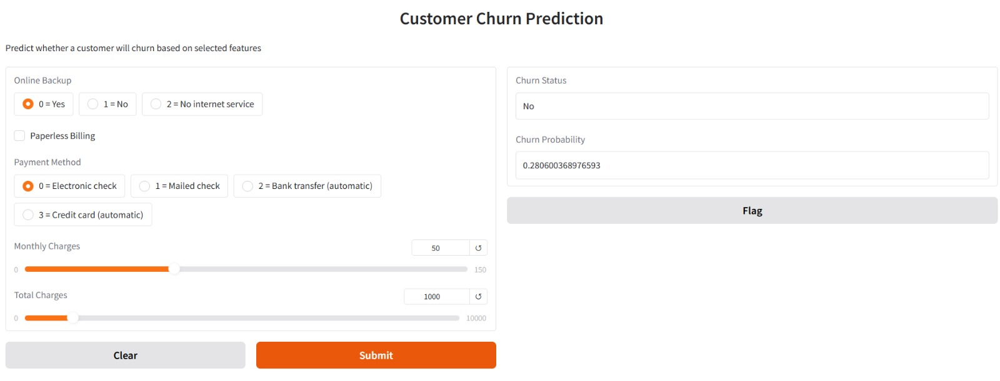
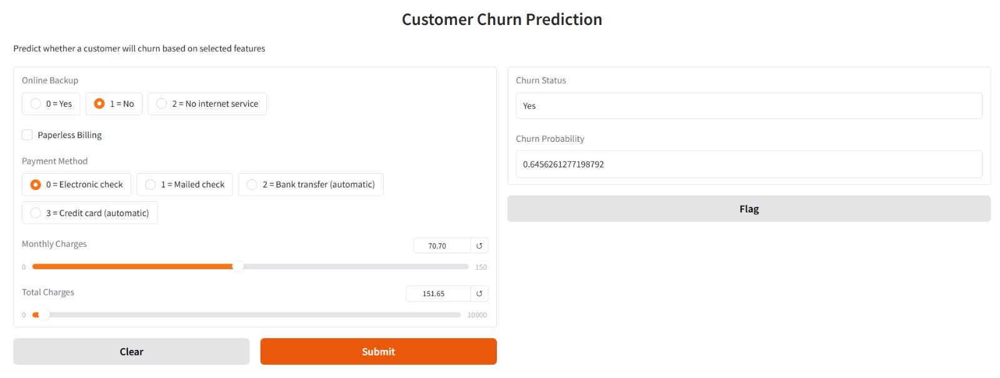

# 📉 Customer Churn Prediction using Neural Network (TensorFlow + Gradio)

An end-to-end Machine Learning project that predicts whether a telecom customer is likely to churn using a trained Artificial Neural Network. The solution includes preprocessing, feature selection, model training, probability-based prediction, and deployment through an interactive Gradio web interface.

---

## 🚀 Project Overview

Customer churn is one of the most critical challenges in subscription-based businesses. Identifying customers likely to leave helps organizations take proactive retention measures.

This project builds a Neural Network model to:

- Classify customers as **Churn (Yes)** or **Not Churn (No)**
- Output churn probability (between 0 and 1)
- Provide real-time predictions through a web interface

---

## 🖥 Application Demo

### 📉 Prediction: Customer Not Likely to Churn


### 📈 Prediction: Customer Likely to Churn


---

## 📊 Dataset

**IBM Telco Customer Churn Dataset**

Source:  
https://raw.githubusercontent.com/IBM/telco-customer-churn-on-icp4d/master/data/Telco-Customer-Churn.csv

The dataset contains customer information such as:

- Demographics
- Services subscribed
- Billing information
- Tenure
- Monthly and total charges
- Churn status

---

## 🧠 Machine Learning Pipeline

The full ML pipeline implemented:

1. Data Cleaning & Preprocessing  
2. Handling missing values  
3. Categorical Encoding  
4. Feature Selection  
5. Feature Scaling using StandardScaler  
6. Neural Network Model Training  
7. Model Evaluation  
8. Model Serialization  
9. Deployment via Gradio  

---

## 🏗 Model Architecture

- Feedforward Neural Network
- Dense Hidden Layers
- ReLU Activation
- Sigmoid Output Layer (Binary Classification)
- Optimizer: Adam
- Loss Function: Binary Crossentropy

The final layer outputs a probability value used to determine churn classification.

---

## 📦 Saved Components

To ensure reproducibility and consistent inference, the following components are saved:

- `best_churn_keras_model.keras` → Trained Neural Network
- `scaler.pkl` → StandardScaler used during training
- `selected_features.pkl` → Final selected features

This guarantees the deployment pipeline matches the training pipeline.

**Here I added 2ChurnAnalysis file to make you know how i trained above saved components**

---

## 🖥 Deployment

The model is deployed using **Gradio**, allowing users to:

- Select customer attributes
- Adjust billing information
- Receive real-time churn predictions

### Input Features Used:
- OnlineBackup (Encoded)
- PaperlessBilling (Binary)
- PaymentMethod (Encoded)
- MonthlyCharges (Numeric)
- TotalCharges (Numeric)

### Output:
- Churn Status (Yes / No)
- Churn Probability (0–1)

---

## 🛠 Tech Stack

- Python
- TensorFlow / Keras
- Scikit-learn
- Pandas / NumPy
- Gradio (UI Deployment)
- Git & GitHub

---

## ▶️ How to Run Locally

```bash
pip install -r requirements.txt
python app.py
